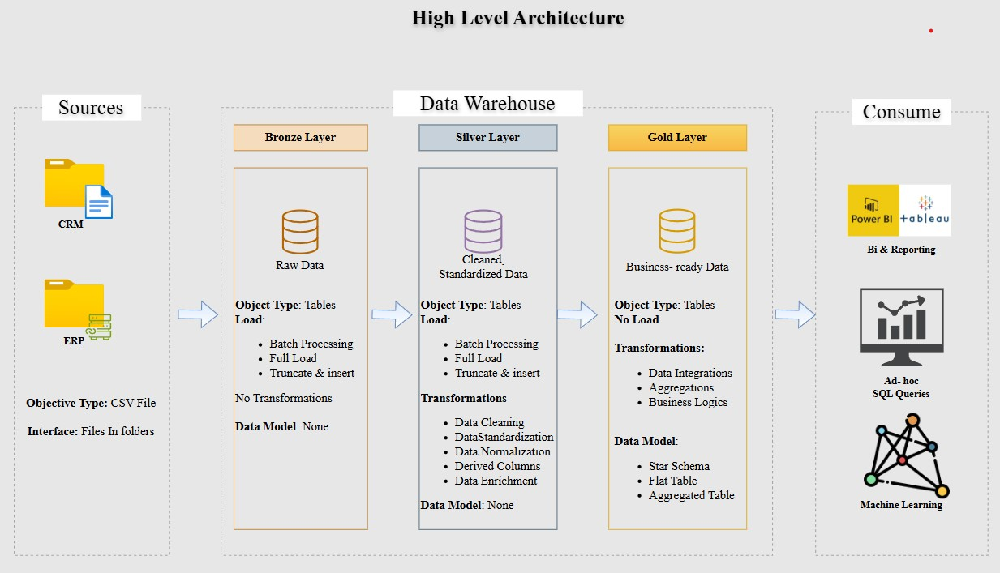

# SQL Data Warehouse Project
### Medallion Architecture | CRM & ERP Integration | Star Schema Design


---

## Project Overview

This project demonstrates the end-to-end design and implementation of a **modern Data Warehouse** using SQL Server, following the **Medallion Architecture** (Bronze → Silver → Gold). It integrates data from two source systems — **CRM** and **ERP** — and transforms it into a business-ready **Star Schema** suitable for analytics and reporting.

---

## Architecture

```
Source Systems
     │
     ▼
┌─────────────────────────────────────────────────────────┐
│               BRONZE LAYER (Raw Ingestion)              │
│   - BULK INSERT from CSV files (CRM + ERP)              │
│   - No transformations; raw source data preserved       │
└────────────────────────┬────────────────────────────────┘
                         │
                         ▼
┌─────────────────────────────────────────────────────────┐
│           SILVER LAYER (Cleansed & Conformed)           │
│   - Deduplication, NULL handling, normalization         │
│   - Data type casting, string trimming                  │
│   - Loaded via stored procedure: silver.load_silver     │
└────────────────────────┬────────────────────────────────┘
                         │
                         ▼
┌─────────────────────────────────────────────────────────┐
│        GOLD LAYER (Business-Ready / Star Schema)        │
│   - dim_customers  │  dim_products  │  fact_sales       │
│   - Surrogate keys, multi-source joins, final views     │
└─────────────────────────────────────────────────────────┘
```


---

## 📂 Project Structure

```
sql-data-warehouse-project/
│
├── datasets/
│   ├── source_crm/
│   │   ├── cust_info.csv          # Customer master data
│   │   ├── prd_info.csv           # Product information
│   │   └── sales_details.csv      # Sales transactions
│   └── source_erp/
│       ├── CUST_AZ12.csv          # ERP customer demographics
│       ├── LOC_A101.csv           # Customer location data
│       └── PX_CAT_G1V2.csv        # Product category reference
│
├── scripts/
│   ├── init_database.sql          # Create DB + Bronze/Silver/Gold schemas
│   ├── bronze/
│   │   ├── ddl_bronze.sql         # Bronze table definitions
│   │   └── proc_load_bronze.sql   # BULK INSERT from CSV → Bronze
│   ├── silver/
│   │   ├── ddl_silver.sql         # Silver table definitions
│   │   └── proc_load_silver.sql   # ETL: Bronze → Silver (cleanse & transform)
│   └── gold/
│       └── ddl_gold.sql           # Gold views (Star Schema)
│
├── tests/
│   ├── quality_checks_silver.sql  # Data quality validations for Silver layer
│   └── quality_checks_gold.sql    # Referential integrity checks for Gold layer
│
└── Architecture.jpg               # Architecture diagram
```

---

## 🔄 ETL Pipeline Details

### 🥉 Bronze Layer — Raw Ingestion
- Loads raw CSV data using `BULK INSERT` from CRM and ERP source files
- Tables: `crm_cust_info`, `crm_prd_info`, `crm_sales_details`, `erp_cust_az12`, `erp_loc_a101`, `erp_px_cat_g1v2`
- Stored Procedure: `EXEC bronze.load_bronze`
- Includes batch duration logging per table load

### 🥈 Silver Layer — Cleansed & Conformed
- Transforms and cleanses data from Bronze using stored procedure `EXEC silver.load_silver`
- Key transformations applied:
  - **Deduplication** using `ROW_NUMBER() OVER (PARTITION BY ...)`
  - **NULL handling** using `ISNULL()` and `COALESCE()`
  - **String normalization** using `TRIM()`, `UPPER()`, `CASE` statements
  - **Data type casting** for dates stored as integers
  - **Key derivation** using `SUBSTRING()` and `REPLACE()` for product category IDs
- Adds `dwh_create_date` audit column to all tables

### 🥇 Gold Layer — Star Schema (Business-Ready)
- Implements a clean **Star Schema** using SQL Views

| Object | Type | Description |
|---|---|---|
| `gold.dim_customers` | View | Customer dimension with CRM + ERP join, gender fallback logic |
| `gold.dim_products` | View | Product dimension with category join; filters historical records |
| `gold.fact_sales` | View | Sales fact table linked to both dimension tables via surrogate keys |

- Surrogate keys generated using `ROW_NUMBER() OVER (ORDER BY ...)`
- Multi-source conflict resolution (CRM as primary, ERP as fallback)

---

##  Data Quality Checks

### Silver Layer Checks
- Null or duplicate primary keys
- Unwanted whitespace in string fields
- Data standardization (gender, marital status, product line)
- Invalid or out-of-order date ranges
- Consistency between related numeric fields (e.g. sales = price × quantity)

### Gold Layer Checks
- Surrogate key uniqueness in `dim_customers` and `dim_products`
- Referential integrity between `fact_sales` and dimension tables
- Detection of orphaned records (unmatched product/customer keys)

---

## How to Run

### Prerequisites
- SQL Server (2019 or later recommended)
- SSMS or Azure Data Studio
- CSV datasets placed in the correct local path

### Execution Order

```sql
-- Step 1: Initialize database and schemas
-- Run: scripts/init_database.sql

-- Step 2: Create Bronze tables
-- Run: scripts/bronze/ddl_bronze.sql

-- Step 3: Load data into Bronze
EXEC bronze.load_bronze;

-- Step 4: Create Silver tables
-- Run: scripts/silver/ddl_silver.sql

-- Step 5: Load and transform data into Silver
EXEC silver.load_silver;

-- Step 6: Create Gold views (Star Schema)
-- Run: scripts/gold/ddl_gold.sql

-- Step 7: Run quality checks
-- Run: tests/quality_checks_silver.sql
-- Run: tests/quality_checks_gold.sql
```

---

## Tech Stack

| Tool | Usage |
|---|---|
| SQL Server (T-SQL) | Database engine and query language |
| Stored Procedures | ETL pipeline orchestration |
| BULK INSERT | Raw data ingestion from CSV |
| SQL Views | Gold layer Star Schema delivery |
| DDL Scripts | Schema and table management |

---

## 💡 Key Concepts Demonstrated

- ✅ Medallion Architecture (Bronze / Silver / Gold)
- ✅ ETL pipeline design with stored procedures
- ✅ Data cleansing and normalization in SQL
- ✅ Star Schema with fact and dimension tables
- ✅ Surrogate key generation
- ✅ Multi-source data integration (CRM + ERP)
- ✅ Data quality validation scripts
- ✅ Pipeline performance monitoring (batch duration logging)

---

## 👤 Author

**Chethan**
- Thanks to **DataWithBaraa** for guidance

---

## 📄 License

This project is open-source and available under the [MIT License](LICENSE).
